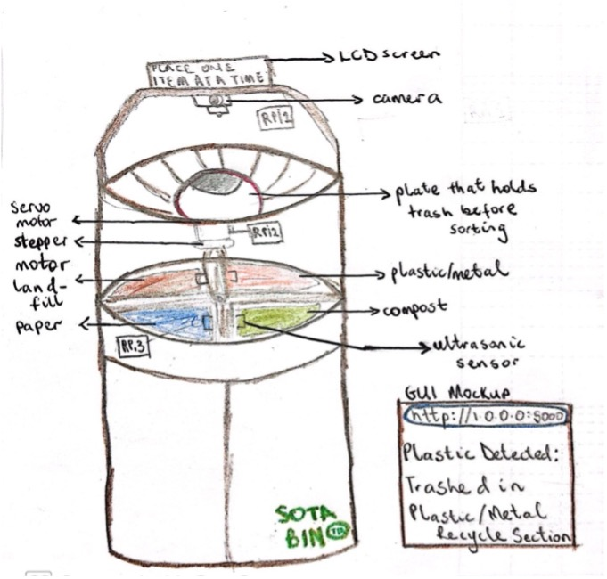
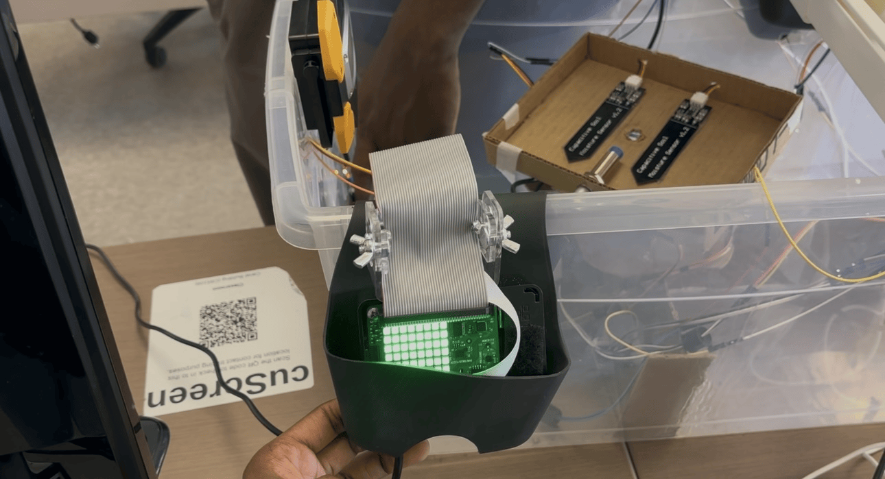
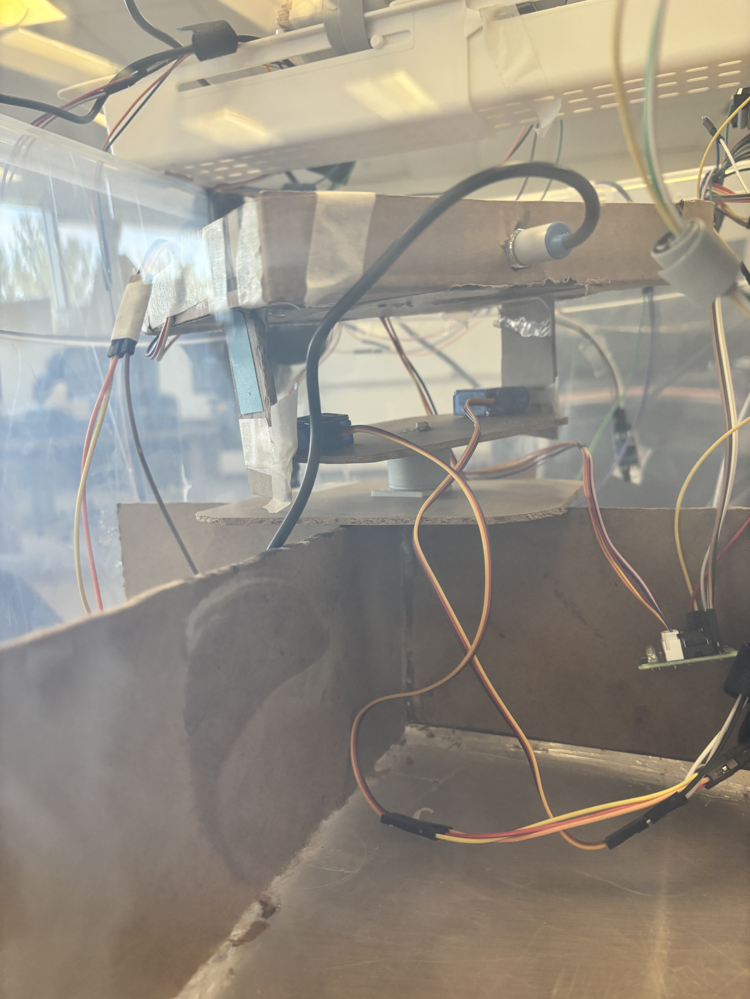
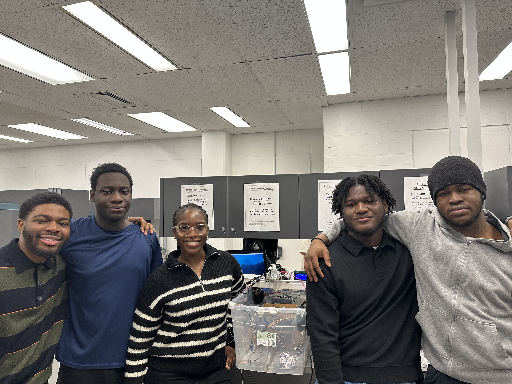

# Sota Bin - Group L2-G3

**Project Title:** Sota Bin - State-of-the-Art Sorting for a Sustainable Future  
**Course:** SYSC3010W25  
**Group:** L2-G3  
**TA:** Afsoon Khodaee  
**Team Members:** Uchenna Obikwelu, Adeyehun Folahanmi, Dearell Tobenna Ezeoke, Emeka Anonyei, Tobiloba Ola

#### Initial Project Image  


#### Physical Implementation 


## Project Objective

**Problem Statement:** Waste misclassification is a persistent issue that contaminates recyclables, increases landfill waste, and reduces recycling efficiency. Many users struggle to sort waste properly due to the lack of real-time guidance and intuitive feedback mechanisms.

**Motivation:** Our main goal was to design a smart waste bin that automatically sorts waste materials while educating its user on how to classify waste items properly. This is why we designed Sota Bin — "State-of-the-Art Sorting for a Sustainable Future." We also addressed the issue of continuous bin monitoring by implementing an automated bin-full detection feature using IR sensors instead of ultrasonic sensors.

**Key Features:**

1. Classifies waste into four categories — landfill, paper, plastic/metal, and compost.
2. Educates users on the classification of items in real-time via a website.
3. Sends alerts when a bin section is full, notifying users and managers.
4. Provides sorting data analytics over time.
5. Allows managers to remotely reset the Sense HAT LED indicator when a bin section is full via the web.

**Key Users:** Everyday users and facility managers in schools, offices, and other public spaces.


## Repository Structure

| Folder             | Description                                                                                                                                                                                                                                                                                                  |
|--------------------|--------------------------------------------------------------------------------------------------------------------------------------------------------------------------------------------------------------------------------------------------------------------------------------------------------------|
| `SOTA BIN MAIN/`   | Contains the main Python implementation for each Raspberry Pi responsible for different subsystems as well as the website code. Each folder includes a README explaining the role and setup:<br>• [`RPi1`](./SOTA%20BIN%20MAIN/RPi1/README.md): Object detection and waste classification<br>• [`RPi2`](./SOTA%20BIN%20MAIN/RPi2/README.md): Motor control<br>• [`RPi3`](./SOTA%20BIN%20MAIN/RPi3/README.md): Bin full monitoring for Paper and Compost bin sections and Website scripts ([see WEB](./SOTA%20BIN%20MAIN/RPi3/WEB/README.md))<br>• [`RPi4`](./SOTA%20BIN%20MAIN/RPi4/README.md): Bin full monitoring for Plastic/Metal and Landfill bin sections<br>• `configs/`: Configuration constants and Firebase credentials |
| `SOTA BIN TEST/`   | Contains end-to-end and unit test scripts for all components.<br>• `HARDWARE_TEST/` and `SOFTWARE_TEST/` are unit test scripts for hardware and software components.<br>• Other folders are for end-to-end testing. |
| `Project_Images/`  | Contains key photos from the project: system diagram, RPi1 peripheral wiring, bin full detection (IR + SenseHAT), motor setup, and group image. All images are referenced in the **Appendix** section below. |
| `README.md`        | This file — the top-level documentation for understanding and running the entire system. |


## Installation Instructions

### Hardware Setup

- RPi1: Camera, color sensor, IR reflective sensor, metal sensor, LCD display
- RPi2: Stepper motor + A4988 driver, servo motor
- RPi3: IR reflective sensors, Sense HAT
- RPi4: IR reflective sensors, Sense HAT
- Power: 5V USB for RPis, 12V adapter for metal sensor

### Software Setup

```bash
# Clone the repository
$ git clone https://github.com/ucheeaa/sota-bin-sysc3010

# Navigate to the appropriate directory (example for RPi1)
$ cd "SOTA BIN MAIN/RPi1"

# Install dependencies (adjust based on your Pi)
$ pip install opencv-python firebase-admin RPi.GPIO sense-hat websocket-client
```
- Add your Firebase `firebase_key.json` to the correct directory (e.g., `RPi1/`, `RPi3/`, etc.)
- Update scripts with your Firebase Realtime Database URL

### Firebase Setup

- Create Firebase project
- Enable Realtime Database
- Download `firebase_key.json` and add to each Pi folder except for RPi2 which doesn't communicate with Firebase

## How to Run the System

1. **RPi1 (Object Classification):**

```bash
cd "SOTA BIN MAIN/RPi1"
python3 classifier_and_commander.py
```
Then in another terminal run: 
```bash
cd "SOTA BIN MAIN/RPi1"
python3 lcd_simulation.py
```

2. **RPi2 (Motor Control):**

```bash
cd "SOTA BIN MAIN/RPi2"
python3 final_motor.py
```

3. **RPi3 (Bin Full Monitoring & Web Interaction):**

```bash
cd "SOTA BIN MAIN/RPi3"
python3 monitor_bins.py
```

4. **RPi4 (Optional Monitoring):**

```bash
cd "SOTA BIN MAIN/RPi4"
python3 bin_full_monitor.py
```

5. **Web Dashboard:**

```bash
cd "SOTA BIN MAIN/RPi3/WEB"
# Open index.html in browser or serve via local server
```

## How to Know It’s Working

- Running SOTA BIN TEST/HARDWARE_TEST and SOTA BIN TEST/SOFTWARE_TEST scripts should pass
  
- LCD screen continuously shows "Place one item at a time."
  
- When waste is placed on plate:
  - Object is detected and classified
  - Classification appears in RPi1 local DB, Firebase and Web UI
  - Servo and stepper motors activate (RPi2) to the appropriate bin section

- When a bin is full:
  - One of the two Sense HATs beems up
  - Web interface alert appears
  - Manager is sent an email

- When reset is clicked (web):
  - Firebase logs the action
  - RPi3 detects it and clears Sense HAT display


## Appendix

### 1. Physical Top View Setup of Sota Bin


### 2. RPi1 Peripheral Devices Circuit Connection


### 3. Bin Full IR Sensor Detection


### 4. Sense HAT Notification Beem RPi3 /RPi4


### 5. Physical Motors Set Up (RPi2)


### 6. Demo Video
[▶️ Watch our team demo](https://drive.google.com/file/d/1fRHqAzUy3opVh30cdAlYEY83HoeIrf7v/view?usp=sharing)

### 7. Team Members

Group L2-G3: Tobiloba, Folahanmi, Uchenna, Dearell, and Emeka.