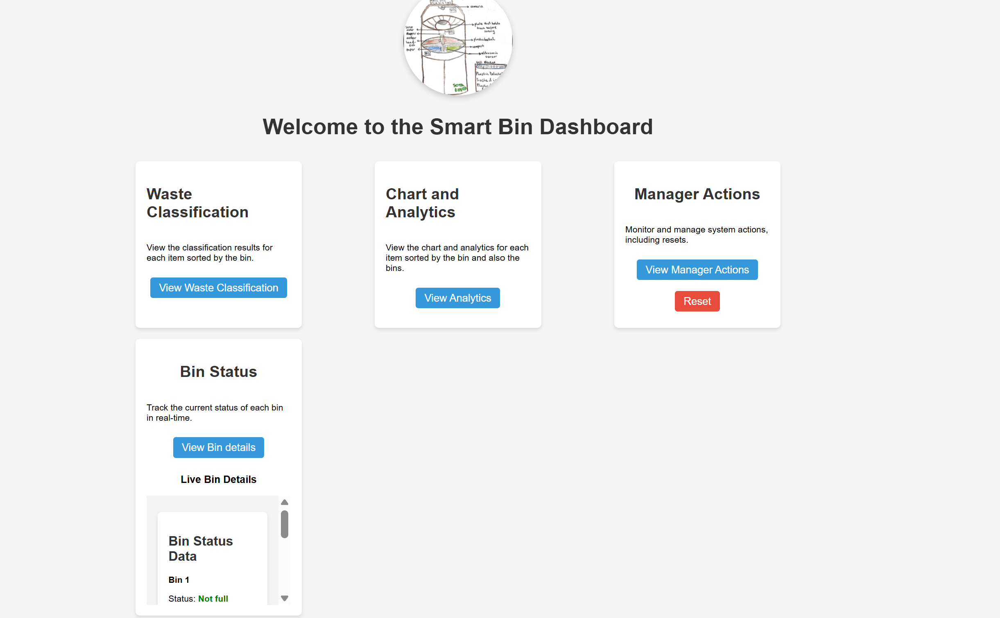
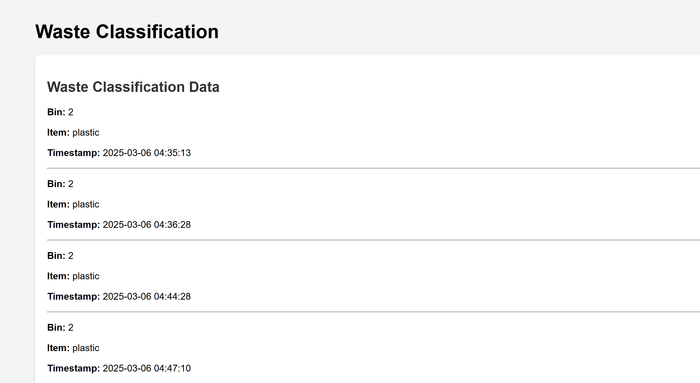
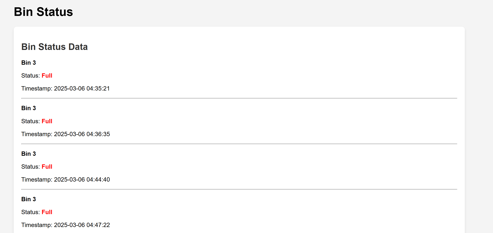
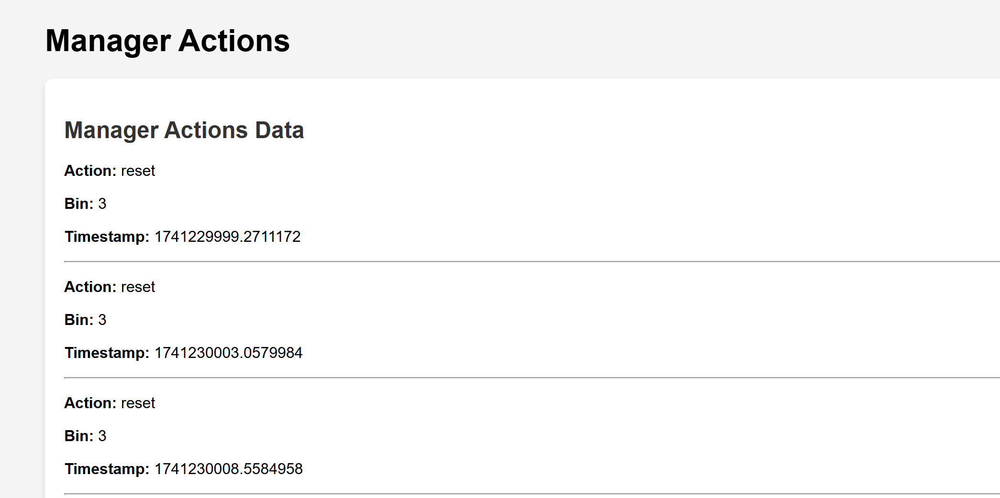
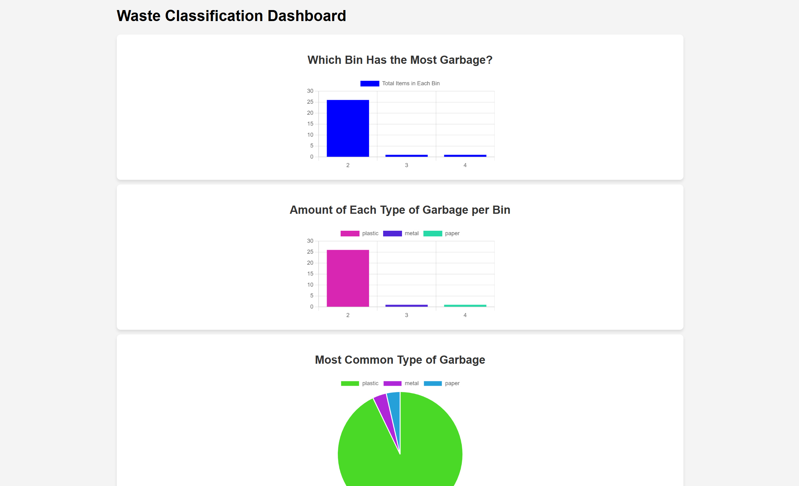

---

# Smart Bin Dashboard

The **Smart Bin Dashboard** provides a real-time tracking system for bins, waste classification, and user actions. It features several pages to interact with the system, including visual data, bin status, waste classification, and manager actions.

## Project Overview
This project consists of five pages:
1. **Main Page** - Provides links to other pages.
2. **Classification Page** - Displays data of sorted garbage and waste classification.
3. **Bin Status Page** - Displays the status of all bins in real-time.
4. **Manager Actions Page** - Lists all actions performed by users.
5. **Analytics Page** - Visual representation of charts and analytics for data insights.

---

## Pages Overview

### 1. **Main Page**
The **Main Page** serves as the entry point to the app. It features four links to navigate to other pages of the dashboard:

- **[Waste Classification](classification.html)**
- **[Bin Status](bin-details.html)**
- **[Manager Actions](manager-actions.html)**
- **[Chart and Analytics](chart.html)**

Each of these links takes the user to their respective pages for detailed information. Below is an image that represents the main page.

---

### 2. **Classification Page**
The **Classification Page** provides a detailed view of sorted garbage. It shows a list of categorized waste based on different bins, including the classification results for each item.

- Displays categorized data such as recyclables, non-recyclables, and hazardous materials.
- Allows users to explore the results of waste classification performed on the garbage collected.

---

### 3. **Bin Status Page**
The **Bin Status Page** displays real-time data for all bins, including their status (e.g., full or not full), timestamps, and other relevant information. It allows users to monitor the current state of all bins.

- Provides up-to-date information on each bin's fill status.
- Each bin is labeled with a unique ID, showing whether it is full, not full, or at any other predefined state.

---

### 4. **Manager Actions Page**
The **Manager Actions Page** logs all the actions performed by the system users. This includes actions like resetting a bin, clearing waste data, or other administrative actions.

- Displays a list of actions that users have performed, providing an audit trail.
- Allows managers to reset bins and perform necessary actions to maintain system functionality.

---

### 5. **Analytics Page**
The **Analytics Page** offers a visual representation of data through charts and graphs. It displays insights and trends based on the status of bins and the waste classification results.

- Provides a graphical view of bin usage and waste categorization over time.
- Helps managers and users understand trends and make data-driven decisions.

---

## How to Use

1. **Main Page**: Start by visiting the **Main Page**. From here, you can navigate to the **Classification Page**, **Bin Status Page**, **Manager Actions Page**, and **Analytics Page**.
   
2. **Classification Page**: This page shows all the classified data related to the waste. You can click through the classification results and understand how each item is categorized into recyclables, non-recyclables, and others.

3. **Bin Status Page**: The **Bin Status Page** will display real-time information about the bins, including whether they are full or not. This helps you monitor the status of bins in real-time.

4. **Manager Actions Page**: In this section, you can see all the actions performed by the system users. You also have the ability to perform certain actions like resetting bins.

5. **Analytics Page**: On the **Analytics Page**, you can view various charts and graphs that give insights into the performance of bins and waste categorization over time.

---

## Technologies Used

- **HTML5** for the structure of the pages.
- **CSS3** for styling and layout.
- **JavaScript** for interactive and dynamic features.
- **Firebase** for real-time data storage and fetching.
- **Charts.js** for data visualization (used in Analytics Page).
- **Responsive design** using Flexbox and Media Queries for different screen sizes.

---

